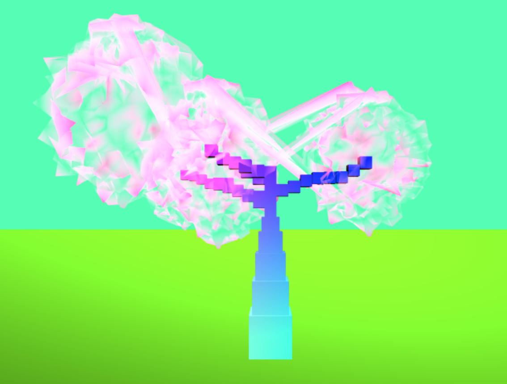
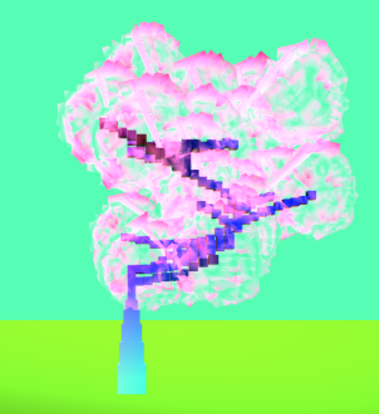

# Homework 4: L-systems

## Description
Emiliya Al Yafei • PennKey: alyafei

Demo Link:
https://mylesing.github.io/l-systems-mylesing/

Space cube tree!

Cubes are dirrently colored as the tree grows. Instead of foliage, a glowering aura appears around the tree. 

## Rules
[F] : grow upwards
[X] : get a random X-Z direction
[Y] : move a random amount in some direction
[+/-] : move in +ive or -ive X direction
[S] : draw aura sphere
[B] : set up base

[Expansion:]
* 'X' --> 'FF[−XYS]FFF[XYS][−XS]+XYS'
* 'F' --> 'F[XYS]'
* '+', 'F[+YS]FFF[XYS][−XS]+XYS'
* '-', 'F[-YS]FFF[XYS][−XS]+XYS'
* 'B', 'B'

## Problems Occured
The OBJ loader indexes the vertices wrong. This seems to be more of a result of the sphere than of the Mesh class itself.
